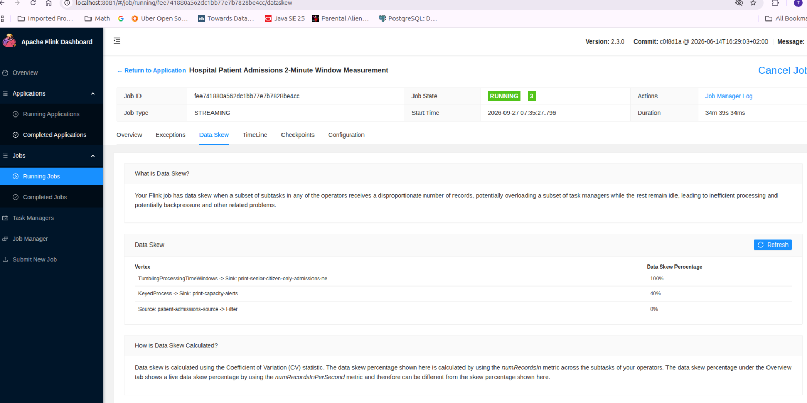

# Data Skew — Flink Web UI

> Related: [Why "Records Sent" at the Source Doesn't Match the Sum You'd Expect](./metrics_discrepancy.md) — a separate Q&A on a related metrics-interpretation gap in this same job, documented against Apache Flink's own [FLIP-587](https://cwiki.apache.org/confluence/display/FLINK/FLIP-587%3A+Expose+per+downstream+target+numRecordsOut+metric).

## Screenshot

The Data Skew tab for the running job "Hospital Patient Admissions 2-Minute Window Measurement" (job ID `fee741880a562dc1bb77e7b7828be4cc`):

The screen shows:

| Vertex | Data Skew Percentage |
|---|---|
| `TumblingProcessingTimeWindows -> Sink: print-senior-citizen-only-admissions-ne` | 100% |
| `KeyedProcess -> Sink: print-capacity-alerts` | 40% |
| `Source: patient-admissions-source -> Filter` | 0% |

## Question

**What does the Data Skew reveal? When should I be concerned?**

## Response

### What Data Skew reveals here

Data Skew shows how evenly the **records-in** metric is spread across the parallel subtasks of each operator. A CV-based percentage near 0% means every subtask is doing roughly the same amount of work; near 100% means one (or a few) subtasks are doing almost all the work while others sit idle.

Looking at the three vertices, the pattern is fully explained by the `keyBy` field each one uses — see [HospitalAdmissionAnalytics.java](../src/main/java/org/muralis/flink/data/source/hospital/HospitalAdmissionAnalytics.java):

| Vertex | keyBy | Distinct keys reaching it | Skew | Why |
|---|---|---|---|---|
| `Source -> Filter` | none (source split assignment) | n/a | **0%** | Every parallel source subtask generates admissions independently and evenly — no key-based routing yet. |
| `TumblingProcessingTimeWindows -> Sink: ...ne` | `EmergencyRoom::getRegionID` | **1** (only `"NE"`, since this stream was already filtered to NE before the keyBy) | **100%** | With only one distinct key value, Flink's hash partitioner sends *every single record* to exactly one subtask. The job runs with `env.setParallelism(2)` (confirmed via the live job's REST API — every vertex has `"parallelism": 2`), so the other subtask gets **zero** records — mathematically guaranteed, not a bug. |
| `KeyedProcess -> Sink: print-capacity-alerts` | `EmergencyRoom::getHospitalID` | 14 (all hospitals, all regions) | **40%** | 14 keys hashed across 2 subtasks won't split perfectly evenly (e.g. 8/6 vs. a true 7/7), so there's *some* natural imbalance, but nowhere near total idleness. |

The key insight: **keying by a field whose value-space is smaller than (or collapses to fewer values than) your parallelism will always produce skew** — it's a direct consequence of `keyBy(RegionID)` on an already-region-filtered stream, where 100% of records carry the identical key `"NE"`.

### When should you actually be concerned?

Skew percentage alone isn't the alarm — **volume combined with skew** is. Ask two questions:

1. **Is the skewed operator actually a bottleneck?** The NE-window operator receives ~25% of total admissions (one region out of four), so even though 100% of *that* traffic lands on one subtask, the absolute record rate is still small (2 events/sec total ÷ ~4 regions ≈ 0.5/sec). One subtask can trivially keep up. Contrast that with a scenario where you key a high-volume stream (e.g. millions of events/sec) by a low-cardinality field — then one subtask would be overwhelmed while its siblings sit at 0% CPU, causing backpressure that ripples upstream.
2. **Are you burning parallelism you configured but aren't using?** If you deliberately set parallelism expecting proportional throughput on the NE-window operator, 100% skew tells you most of those slots are wasted — worth right-sizing that specific operator's parallelism (e.g. `.setParallelism(1)`) rather than inheriting the job's default.

For this job specifically: the 100% skew on the NE-only window is **expected and benign** given the design (filtering to a single region *before* keying by that same region field makes the keyBy effectively redundant once already filtered to one value). The 40% skew on the capacity monitor is normal, low-cardinality-key variance and not worth acting on. Concern would be warranted if the Overview tab's live "Records In/Sec" or backpressure indicators showed sustained high load, or if a future change increased volume on the NE-filtered branch significantly while parallelism stayed fixed.
